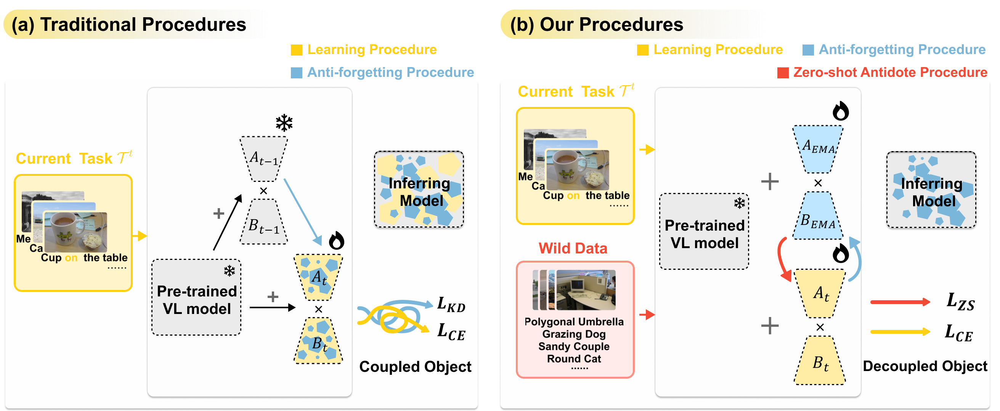

## Stabilizing Zero-Shot Prediction: A Novel Antidote to Forgetting in Continual Vision-Language Tasks


<p align="center">

</p>

## Abstract
Continual learning (CL) empowers pre-trained vision-language (VL) models to efficiently adapt to a sequence of downstream tasks. However, these models often encounter challenges in retaining previously acquired skills due to parameter shifts and limited access to historical data. 
In response, recent efforts focus on devising specific frameworks and various replay strategies, striving for a typical learning-forgetting trade-off. 
Surprisingly, both our empirical research and theoretical analysis demonstrate that the stability of the model in consecutive zero-shot predictions serves as **a reliable indicator** of its anti-forgetting capabilities for previously learned tasks. 
Motivated by these insights, we develop a novel replay-free CL method named **ZAF (Zero-shot Antidote to Forgetting)**, which preserves acquired knowledge through a zero-shot stability regularization applied to wild data in a plug-and-play manner. 
To enhance efficiency in adapting to new tasks and seamlessly access historical models, we introduce a parameter-efficient EMA-LoRA neural architecture based on the Exponential Moving Average (EMA). 
ZAF utilizes new data for low-rank adaptation (LoRA), complemented by a zero-shot antidote on wild data, effectively decoupling learning from forgetting. 
Our extensive experiments demonstrate ZAF's superior performance and robustness in pre-trained models across various continual VL concept learning tasks, achieving leads of up to **3.70%**, **4.82%**, and **4.38%**, along with at least a **10x** acceleration in training speed on three benchmarks, respectively. 
Additionally, our zero-shot antidote significantly reduces forgetting in existing models by at least **6.37%**.

## Our Empirical Findings
Our empirical research and theoretical analysis have uncovered that the stability of the model in consecutive zero-shot predictions serves as **a reliable indicator** of its anti-forgetting capabilities for previously learned tasks. 
To illustrate this, we present empirical findings using two example GIFs: the first displays visual comparisons of different existing continual learning (CL) methods, and the second demonstrates our ZAF method using various alpha values, which determine the model parameter update rate.
The higher the value the slower the update.

|  |  |  |
|:-------------------------------------:|:--------------------------------------------------------------------:|:-------------------------------------------------------------------------------------------:|
| Evaluation matrix                     | Heatmaps of different CL methods                                      | Heatmaps for our ZAF across various hyperparameter values                                    |


By analyzing the variations, we observe that larger average values and reduced fluctuations in the red area, representing zero-shot predictions, typically correspond to similar patterns in the blue area, which signify anti-forgetting capabilities. This correlation does not adversely affect the yellow area, which represents the learning of new tasks.
These observations confirm the relation between a model’s consecutive zero-shot prediction abilities and its anti-forgetting capabilities. 
Our findings further suggest that by systematically stabilizing robust zero-shot predictions during continual learning, we can significantly enhance the model's ability to retain historical knowledge without compromising the acquisition of new information.


## Effects of Our Zero-shot Antidote

<p align="center">

</p>

As demonstrated in the figure, incorporating our zero-shot antidote significantly enhances zero-shot prediction performance on unseen tasks (indicated by the upper triangular red areas) for each method, without compromising their learning abilities (represented by the diagonal yellow areas). 
Furthermore, the anti-forgetting capability (shown in the lower triangular blue areas) of each method is also substantially improved, proving that our zero-shot can decouple the learning and forgetting.
Even though ConStruct-VL already exhibits strong anti-forgetting capabilities, its performance is further enhanced when augmented with the zero-shot prediction ability provided by the antidote.
These visual comparisons not only confirm the effectiveness of our zero-shot antidote but also reinforce our empirical findings.

## Quantitive Comparisions with SOTA methods
The FAA is a critical metric that highlights the performance discrepancy between continual learning methods and joint learning. 
CAA provides a comprehensive view of overall historical performance, and FFM quantifies the model's anti-forgetting capability.
<p align="center">

</p>
Considering the narrow margins between ZAF and Joint Learning—the ultimate goal of continual learning, the performance of our ZAF method is notably impressive. Additionally, our results confirm that despite the inherent limitations in the zero-shot capabilities of pre-trained vision-language (VL) models (BLIP and BLIP w/ CapFilt-L), our zero-shot antidote still effectively mitigates forgetting. This underscores its utility and significantly enhances its value in continual learning scenarios.


## Installation and Usage

### Prerequisites
This project builds upon the works and codes done in [BLIP: Bootstrapped Language Image Pretraining](https://github.com/salesforce/BLIP) and [ConStruct-VL: Data-Free Continual Structured VL Concepts Learning](https://github.com/jamessealesmith/ConStruct-VL) . To get started, set up a conda environment and install the requirements listed by our repo.

### Configurations
**Data Config:**
Ensure to set custom paths to datasets in the data configuration file located at `configs/task/nlvr_vl_checklist.yaml` according to your specific setup. As described in the paper, experiments are conducted from the two popular publicly available VL datasets: Visual Genome (VG) and Visual Attributes in the Wild (VAW), building on protocols proposed in the VL-Checklist. The user will need to download these datasets on their own in [VG & VAW](https://homes.cs.washington.edu/~ranjay/visualgenome/api.html).
Our wild data is in configs/continual/zero_shot.json.

**Pre-trained Model Config:**
Ensure to set custom paths to checkpoint in the benchmark configuration file located at `configs/task/xxx.yaml` according to your specific setup.
The open-source pre-trained model checkpoints are provided in [BLIP: Bootstrapped Language Image Pretraining](https://github.com/salesforce/BLIP). Specifically, you can download the BLIP, BLIP w/ CapFilt-L, BLIP w/ NVLR checkpoints from [BLIP](https://storage.googleapis.com/sfr-vision-language-research/BLIP/models/model_base.pth), [BLIP w/ CapFilt-L](https://storage.googleapis.com/sfr-vision-language-research/BLIP/models/model_base_capfilt_large.pth), [BLIP w/ NVLR](https://storage.googleapis.com/sfr-vision-language-research/BLIP/models/model_base_nlvr.pth).

### Running the Code to reproduce the results of our ZAF
```bash
torchrun run_me.py --config ./configs/continual/7task_VG+VAW_checklist.yaml --zsl_config ./configs/continual/zero_shot.yaml \\
--eval_every 1 --freeze_text_emb --agent_type lora --agent_name ZAF --mu 16 --external_lr 0.00125 \\
--ema epoch --ema_lora ema --ema_alpha 0.85 --save_frequency every --output_dir 7vg+vaw_zaf

torchrun run_me.py --config ./configs/continual/7task_VG_checklist.yaml --zsl_config ./configs/continual/zero_shot.yaml \\
--eval_every 1 --freeze_text_emb --agent_type lora --agent_name ZAF --mu 16 --external_  lr 0.00125 \\
--ema epoch --ema_lora ema --ema_alpha 0.85 --save_frequency every --output_dir 7vg_zaf

torchrun run_me.py --config ./configs/continual/5task_VAW_checklist.yaml --zsl_config ./configs/continual/zero_shot.yaml \\
--eval_every 1 --freeze_text_emb --agent_type lora --agent_name ZAF --mu 16 --external_lr 0.00125 \\
--ema epoch --ema_lora ema --ema_alpha 0.85 --save_frequency every --output_dir 5vaw_zaf
```
## Citation
If you found our work useful for your research, please cite our work:

@inproceedings{
gao2024stabilizing,
title={Stabilizing Zero-Shot Prediction: A Novel Antidote to Forgetting in Continual Vision-Language Tasks},
author={Zijian Gao and Xingxing Zhang and Kele Xu and Xinjun Mao and Huaimin Wang},
booktitle={The Thirty-eighth Annual Conference on Neural Information Processing Systems},
year={2024}
}

